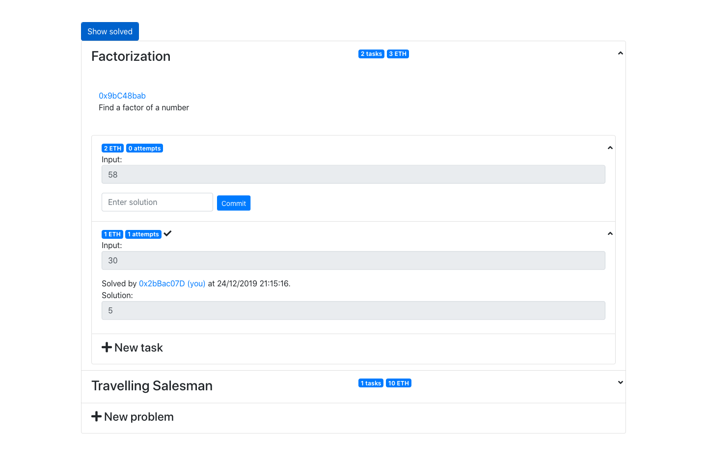

# Ethereum platform for bounty problem solving

This is an Ethereum based platform where you can set tasks to be solved
in exchange for a reward in ether or solve other's tasks yourself.

## Definitions

A **problem** is defined by the type of its input and output, and by relation between the two.
For example, the factorization problem has a positive integer as the input and a positive integer as the output (solution).
Output integer should be a non-trivial factor of the input integer. Otherwise the solution is not correct.

We represent a problem by an Ethereum smart contract with the following signature:

```solidity
contract ProblemContract {
    function getDescription() public view returns(string);
    function getName() public view returns(string);
    function check(uint[] input, uint[] output) public pure returns (bool);
}
```

The most important method is `check`. It takes an input value and an output value and returns `true` iff the output value is the correct solution to the input value.

Have a look at one possible implementation of the Factorization problem contract:
```solidity
pragma solidity ^0.4.24;

contract Factorization {
    string constant name = "Factorization";
    string constant description = "Find a factor of a number";

    function getName() public view returns(string) {
        return name;
    }

    function getDescription() public view returns(string) {
        return description;
    }

    function check(uint[] input, uint[] output) public pure returns (bool) {
        if (input.length != 1 || output.length != 1) {
            return false;
        }

        uint n = input[0];
        uint factor = output[0];

        if (1 < factor && factor < n && n % factor == 0) {
            return true;
        }

        return false;
    }
}
```

Currently, inputs and outputs are restricted to arrays of unsigned integers. This doesn't really make any problems
impossible to represent, but it might be awkward to convert arbritrary input types to unsigned integers.

A **task** is an input to a problem, along with some reward in ether. The platform ensures that
whoever first submits the solution to the task (which passes the validation by the `check` function) gets the reward.

For instance, Alice could submit a factorization task with the input number being 30. Bob could then
submit 2 as a solution and win the prize.

To prevent cheating, solution submitting is implemented as a two-phase process: 
1. **commit phase**: a salted hash of solver's address and the solution is submitted
2. **reveal phase**: raw solution and the hash salt are submitted

## Developing

Backend of this dapp is composed of several smart contracts (see `contracts/`) that need to be deployed on the Ethereum blockchain.
Frontend is a React+Bootstrap app, see `app/` for details.

Install ethereum test blockchain:

```bash
npm install -g ganache-cli
```

Leave it running (on `localhost:8545` by default):

```
ganache-cli -b 3
```

Install the project:

Clone this repository and install the project:

```bash
git clone git@github.com:ikatanic/solveth.git
cd solveth/app
npm install
```

Deploy contracts onto the test blockchain

```bash
truffle migrate
```

Start the web server:

```
npm start
```

Optionally, install [MetaMask](https://metamask.io/) extension and configure it to talk to
the test blockchain you set up.

Open `localhost:3000` in your browser to start using the dapp.

## Screenshot
